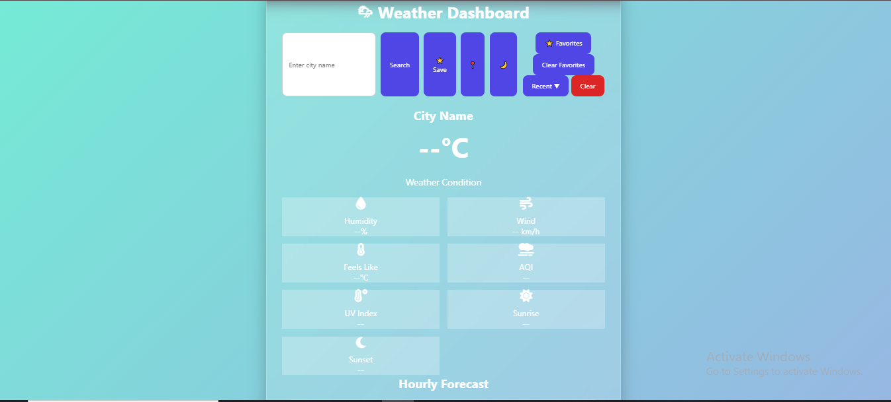
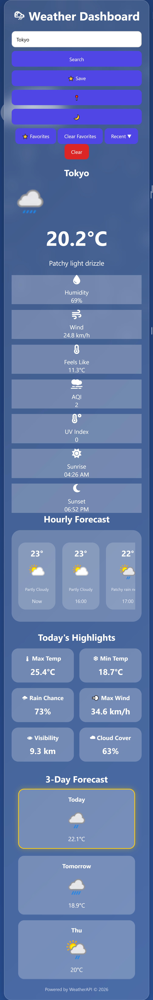

# 🌦 Dynamic Weather Dashboard

A modern and responsive **Weather Dashboard Web Application** developed collaboratively by a team of three members. The application provides real-time weather information, hourly forecasts, weather highlights, air quality monitoring, favorites management, recent searches, dynamic weather animations, and dark mode support.

The project focuses on delivering an interactive and visually appealing weather experience with responsive design and real-time weather insights powered by WeatherAPI. WeatherAPI provides current weather, forecast, astronomy, and air quality data used throughout this application. :contentReference[oaicite:0]{index=0}

---

## 🔗 Repository

**GitHub Repository:**

https://github.com/Anjanisuryaprabha-K/Dynamic-Weather-Dashboard

---

## ✨ Features

### 🌍 Real-Time Weather Data
- Search weather by city name
- Current location weather using Geolocation API
- Live weather updates powered by WeatherAPI

### 🌡 Weather Information
- Current Temperature
- Feels Like Temperature
- Humidity
- Wind Speed
- UV Index
- Air Quality Index (AQI)
- Sunrise & Sunset Times

### ⏰ Forecasts
- Hourly Weather Forecast
- 3-Day Weather Forecast
- Today's Weather Highlights

### ⭐ User Features
- Save Favorite Cities
- Recent Search History
- Clear Recent Searches
- Clear Favorites
- Quick Access Dropdown Menus

### 🎨 Dynamic UI
- Dark Mode
- Glassmorphism Design
- Responsive Layout
- Weather-Based Dynamic Backgrounds

### 🌧 Weather Animations
- Rain Animation
- Snow Animation
- Cloud Animation
- Thunderstorm Animation
- Night Sky Animation
- Dynamic Weather Effects

### 📱 Responsive Design
- Mobile Friendly
- Tablet Friendly
- Desktop Friendly

---

## 📸 Screenshots

### 🏠 Home Dashboard



---

### 🌙 Dark Mode


---

### ⏰ Hourly Forecast


---

### ⭐ Favorites Feature


---

### 🌧 Rainy Weather Theme


---

### 📱 Mobile Responsive View



---

## 🛠 Technologies Used

### Frontend
- HTML5
- CSS3
- JavaScript (ES6)

### APIs
- WeatherAPI
- Geolocation API

### Browser Storage
- Local Storage

### UI Libraries
- Font Awesome

---

## 📂 Project Structure

```text
Dynamic-Weather-Dashboard/
│
├── index.html
├── style.css
├── script.js
├── README.md
│
└── assets/
    └── screenshots/
        ├── home.png
        ├── dark-mode.png
        ├── hourly-forecast.png
        ├── favorites.png
        ├── rainy-theme.png
        └── mobile-view.png
```

---

## ⚙️ Installation & Setup

### 1. Clone the Repository

```bash
git clone https://github.com/Anjanisuryaprabha-K/Dynamic-Weather-Dashboard.git
```

### 2. Navigate to Project Folder

```bash
cd Dynamic-Weather-Dashboard
```

### 3. Open the Project

Open:

```text
index.html
```

or run using:

```text
VS Code Live Server
```

---

## 🔑 API Configuration

This project uses WeatherAPI for real-time weather and forecast information. WeatherAPI supports current weather, forecasts, astronomy data, and air quality information. :contentReference[oaicite:1]{index=1}

Replace the API key inside:

```javascript
const apiKey = "YOUR_API_KEY";
```

Get your free API key from:

https://www.weatherapi.com/

---

## 🚀 How to Use

1. Enter a city name in the search box.
2. Click the Search button.
3. View current weather details.
4. Check hourly and 3-day forecasts.
5. Save cities to Favorites.
6. Access Recent Searches instantly.
7. Switch between Light and Dark Mode.
8. Use Current Location to get weather automatically.

---

## 🌟 Project Highlights

✔ Real-Time Weather Updates

✔ Hourly Forecast

✔ 3-Day Forecast

✔ AQI Monitoring

✔ UV Index Tracking

✔ Sunrise & Sunset Information

✔ Dynamic Weather Animations

✔ Favorites Management

✔ Recent Searches

✔ Dark Mode Support

✔ Responsive Design

✔ Geolocation-Based Weather

✔ Glassmorphism User Interface

---

## 🔮 Future Enhancements

- 7-Day Forecast
- Temperature Trend Graphs
- Weather Alerts & Notifications
- Voice Search
- Multi-Language Support
- Progressive Web App (PWA)
- Weather Maps Integration

---

## 👥 Team Members

This project was collaboratively developed by:

- **Satish Preetham Vangalapudi**
- **Anjani Surya Prabha Katta**
- **Tejaswini Dasari**

### Roles & Contributions

| Team Member | Contribution |
|------------|-------------|
| Satish Preetham Vangalapudi | Frontend Development, Weather API Integration, Dynamic Weather Features |
| Anjani Surya Prabha Katta | UI/UX Design, Responsive Layout, Dark Mode & Weather Animations |
| Tejaswini Dasari | Testing, Debugging, Documentation & Feature Enhancements |

---

## 🤝 Contributing

Contributions, suggestions, and improvements are welcome.

1. Fork the repository
2. Create a new branch
3. Make your changes
4. Commit changes
5. Push to your branch
6. Open a Pull Request

---

## 📜 License

This project is intended for educational, learning, and portfolio purposes.

© 2026 Dynamic Weather Dashboard Team. All Rights Reserved.